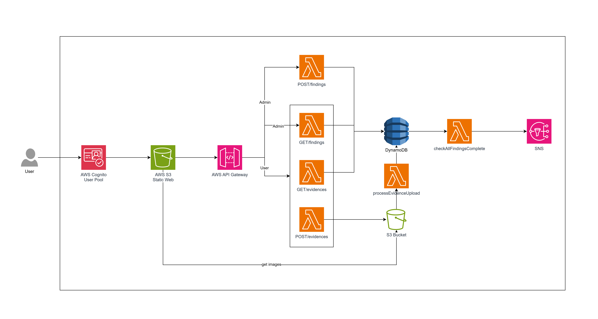

# Security Compliance Checker

## Project Overview

The Security Compliance Checker is a serverless web application that allows users to upload compliance evidence (e.g., logs, screenshots, PDFs) for findings. 

The system tracks which findings have evidence, provides a dashboard, and notifies admins when all findings are complete.

This project is built entirely on AWS serverless services.

## Serverless Architecture



## Data Model
Single-table approach with AWS DynamoDB

| PK                  | SK                    | type     | attributes                            |
| ------------------- | --------------------- | -------- | ------------------------------------- |
| CASE#<caseId>       | FINDING#<findingId>   | FINDING  | title, description, status, , assignTo, createdAt |
| FINDING#<findingId> | EVIDENCE#<evidenceId> | EVIDENCE | fileName, s3Url, uploadedAt, status   |

## Prerequisite

### Create Cognito User Pool with users:

```AWS CLI
aws cognito-idp create-user-pool \
  --pool-name MyAppUserPool \
  --auto-verified-attributes email \
  --policies '{
      "PasswordPolicy": {
        "MinimumLength": 8,
        "RequireLowercase": true,
        "RequireUppercase": true,
        "RequireNumbers": true,
        "RequireSymbols": false
      }
    }'
```

Then:

```AWS CLI


